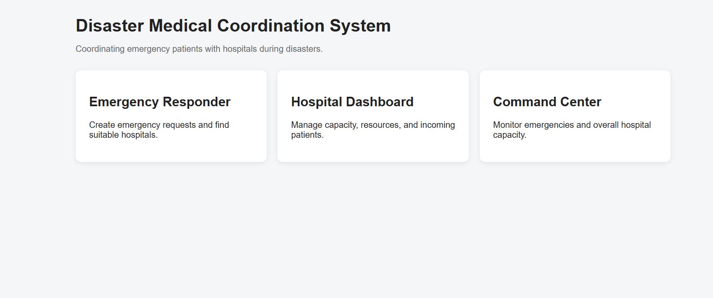
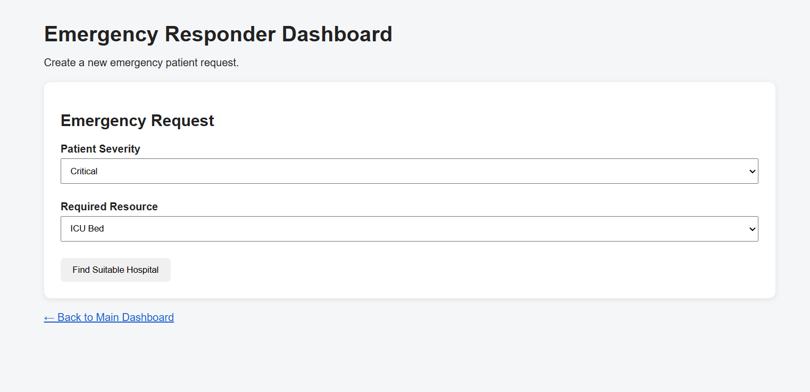
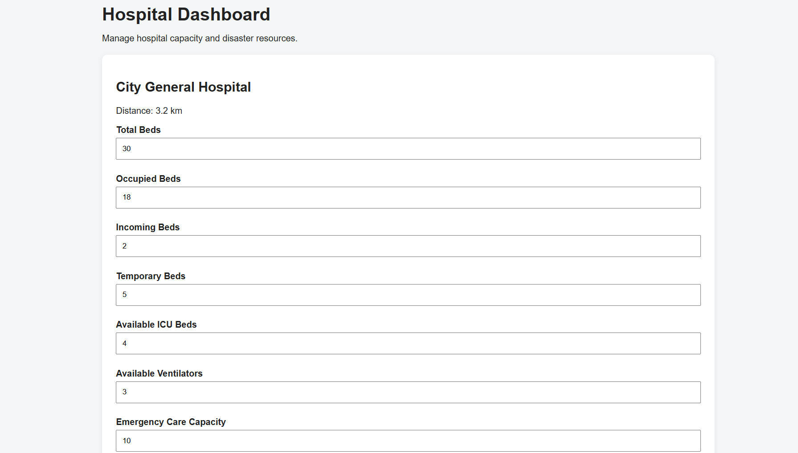
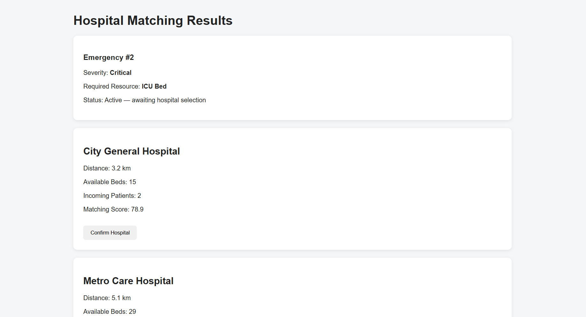
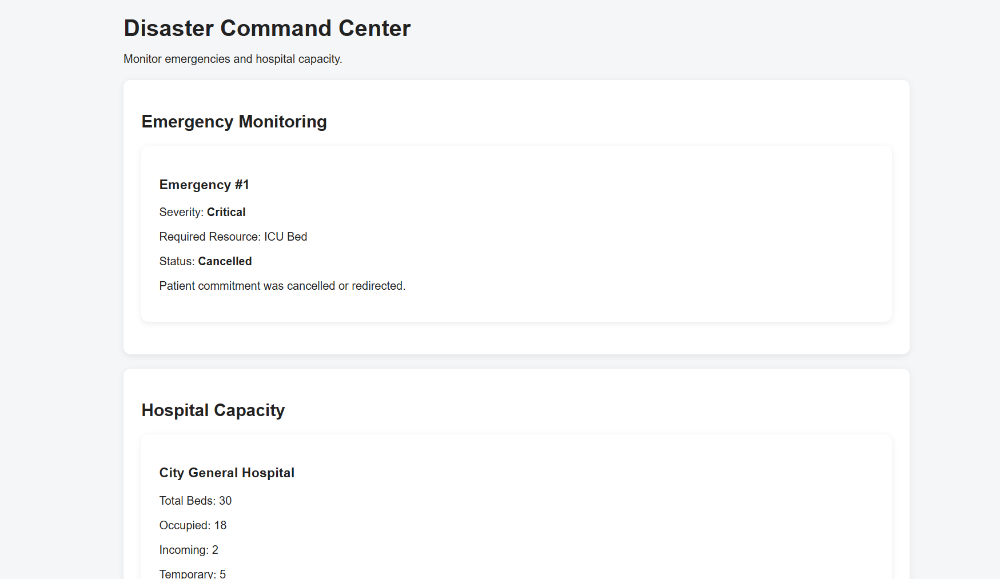

# 🚑 Disaster Medical Coordination System

> **In a disaster, knowing where a hospital is isn't enough. We need to know whether it can actually handle the patient.**

A prototype disaster-time medical coordination system designed to help emergency responders identify suitable hospitals based on **patient severity, required medical resources, distance, and real-time hospital capacity**.

The system focuses on a problem that becomes critical during large-scale emergencies: multiple patients may require medical attention simultaneously, while hospitals have limited and changing resources.

Rather than functioning as a basic SOS or hospital-directory application, this prototype focuses on **resource-aware hospital coordination and capacity management**.

---

## 🎯 Problem Statement

During disasters such as accidents, floods, earthquakes, or building collapses, emergency responders may need to coordinate the movement of multiple patients to hospitals within a short period of time.

Simply knowing which hospitals are nearby is not sufficient.

A hospital may:

* Have limited available beds
* Have no suitable ICU capacity
* Have insufficient ventilators
* Already have patients on the way
* Be receiving several emergency cases simultaneously

Therefore, hospital selection should consider not only **distance**, but also **patient requirements and actual available capacity**.

### Core problem

> **How can an emergency coordination system identify and prioritize hospitals that are both geographically suitable and operationally capable of handling a particular emergency?**

This prototype explores that problem through a rule-based hospital matching and capacity-management workflow.

---

## 💡 Proposed Solution

My prototype introduces a **Disaster Medical Coordination System** consisting of four major components:

1. **Emergency Responder Interface**
2. **Hospital Dashboard**
3. **Disaster Command Dashboard**
4. **Rule-Based Hospital Matching Engine**

A responder enters the patient's:

* Emergency severity
* Required medical resource

The system then evaluates available hospitals using factors such as:

* Available bed capacity
* Required medical resources
* Distance
* Incoming/committed patients

The system produces a ranked list of suitable hospitals rather than simply displaying nearby hospitals.

---

## 🔄 System Workflow

```text
Emergency Request
       ↓
Patient Severity + Required Resource
       ↓
Hospital Matching Engine
       ↓
Evaluate Hospital Capacity
       ↓
Evaluate Resource Availability
       ↓
Consider Distance
       ↓
Consider Incoming/Committed Patients
       ↓
Rank Suitable Hospitals
       ↓
Responder Confirms Hospital
       ↓
Hospital Capacity Becomes "Incoming"
       ↓
Patient Arrives
       ↓
Patient Admitted
       ↓
Capacity Updated
```

---
## 🖥️ Prototype Screenshots

### Main Dashboard



### Emergency Responder Dashboard



### Hospital Dashboard



### Hospital Matching Results



### Disaster Command Center



## 🏥 Hospital Capacity Model

One of the important aspects of this prototype is that it does not treat hospital capacity as a single static number.

The system separates capacity into:

| Capacity State           | Meaning                                                                                |
| ------------------------ | -------------------------------------------------------------------------------------- |
| **Available**            | Beds currently available for new patients                                              |
| **Occupied**             | Beds currently occupied by admitted patients                                           |
| **Incoming / Committed** | Capacity already reserved for patients who have been assigned but have not yet arrived |
| **Temporary**            | Additional beds created for disaster situations                                        |

### Effective Available Capacity

The prototype calculates effective availability approximately as:

```text
Effective Available =
Total Beds
+ Temporary Beds
- Occupied Beds
- Incoming Beds
```

### Example

Suppose a hospital has:

```text
Total Beds       = 10
Occupied Beds    = 2
Temporary Beds   = 0
Incoming Patients = 3
```

Then:

```text
Effective Available = 10 + 0 - 2 - 3
                     = 5 beds
```

Although the hospital might initially appear to have 8 unoccupied beds, only **5 beds are genuinely available for new assignments**.

This distinction is central to the prototype's coordination logic.

---

## 🚨 Emergency Priority

Emergencies are categorized into four priority levels:

* 🔴 **Critical**
* 🟠 **High**
* 🟡 **Medium**
* 🟢 **Low**

The severity level influences the hospital-ranking process.

The prototype is intended to demonstrate the **coordination logic**, not to make clinical decisions or replace medical professionals.

---

## 🧠 Hospital Matching Engine

The prototype uses a rule-based scoring mechanism to rank hospitals.

The ranking considers several factors:

### 1. Capacity

Hospitals with greater effective available capacity receive a higher score.

### 2. Required Resources

The system considers the requested resource, such as:

* ICU Bed
* Ventilator
* Emergency Care
* General Bed

Hospitals without the required resource are filtered out of the matching process.

### 3. Distance

Hospitals that are closer to the emergency location receive a higher score.

### 4. Incoming Patients

Hospitals that already have multiple incoming/committed patients receive a penalty because part of their capacity is already reserved.

### 5. Emergency Severity

Higher-severity emergencies receive greater priority during the ranking process.

The result is a **ranked hospital list**, allowing the responder to see the most suitable options first.

---

## 📊 Why This Is Different From a Basic Hospital Finder

A conventional hospital finder might answer:

> "Which hospitals are nearby?"

This prototype attempts to answer a more useful disaster-management question:

> **"Which nearby hospital is actually capable of handling this emergency right now?"**

For example:

```text
Hospital A
Distance: 2 km
Available capacity: 1
Required resource: unavailable

Hospital B
Distance: 4 km
Available capacity: 5
Required resource: available

Hospital C
Distance: 6 km
Available capacity: 8
Required resource: available
```

The nearest hospital is not necessarily the best hospital.

The prototype therefore combines **proximity + resources + capacity + incoming load** instead of relying on distance alone.

---

## 🖥️ Main System Modules

### 1. Emergency Responder

The responder can:

* Create an emergency request
* Select severity
* Select required medical resource
* View ranked hospital recommendations
* Confirm a hospital for the patient

---

### 2. Hospital Dashboard

The hospital can update:

* Total beds
* Occupied beds
* Incoming patients
* Temporary beds
* Resource availability

This allows the system to simulate changing hospital conditions during a disaster.

---

### 3. Disaster Command Dashboard

The command dashboard provides a centralized view of:

* Active emergencies
* Incoming patients
* Admitted patients
* Cancelled/redirected cases
* Hospital capacity
* Current incoming commitments
* Effective available capacity

This provides a basic command-level view of the overall situation.

---

### 4. Hospital Matching Engine

The matching engine:

1. Receives emergency requirements
2. Retrieves hospital information
3. Calculates effective available capacity
4. Checks required resources
5. Evaluates distance
6. Considers incoming commitments
7. Applies emergency severity
8. Generates a ranking
9. Returns suitable hospitals to the responder

---

## 🔁 Patient Commitment Lifecycle

A major part of the prototype is the distinction between **selection** and **commitment**.

### Step 1 — Emergency Created

The responder creates an emergency request.

```text
Emergency → Active
```

### Step 2 — Hospital Selected

The responder chooses a suitable hospital.

```text
Hospital → Selected
```

### Step 3 — Patient Marked as Incoming

The patient is now considered committed to that hospital.

```text
Emergency → Incoming
Hospital Incoming Beds → +1
```

The capacity is therefore no longer treated as completely free.

### Step 4 — Patient Admitted

When the patient reaches the hospital:

```text
Emergency → Admitted
Incoming Beds → -1
Occupied Beds → +1
```

### Step 5 — Cancellation / Redirection

If the patient is redirected:

```text
Emergency → Cancelled
Incoming Beds → -1
```

This releases the previously committed capacity.

---

## 🧩 Relationship With Existing Systems

This prototype is **not intended to replace existing emergency-management, hospital-management, ambulance-dispatch, or healthcare information systems**.

Instead, it can be viewed as a **basic coordination building block** that could potentially be integrated into a larger disaster-response ecosystem.

For example:

```text
Existing Emergency System
          │
          ▼
Emergency / Patient Data
          │
          ▼
┌─────────────────────────────┐
│ Disaster Medical            │
│ Coordination Layer          │
│                             │
│ Hospital Matching           │
│ Capacity Tracking           │
│ Resource Awareness          │
│ Incoming Commitments        │
└─────────────────────────────┘
          │
          ▼
Existing Hospital / EMS / Command Infrastructure
```

The idea is to evolve the prototype from a standalone demonstration into a coordination component that can work alongside existing systems.

---

## 🧪 Prototype Assumptions & Limitations

The current implementation intentionally operates within a controlled prototype environment.

### 1. Network Availability

The prototype assumes that the relevant users and systems have network connectivity.

A real disaster environment may experience:

* Network congestion
* Infrastructure failure
* Internet outages
* Communication delays

Handling disconnected or intermittently connected environments is outside the current prototype scope.

---

### 2. No Google Maps / Live Mapping Integration

The current prototype **does not use Google Maps, Google Maps API, GPS tracking, or another live mapping service**.

Hospital distances are represented using predefined/demo values.

This keeps the prototype focused on the **medical coordination and resource-allocation logic** rather than external mapping infrastructure.

A future implementation could integrate:

* GPS coordinates
* Mapping APIs
* Real-time distance calculation
* Travel-time estimation
* Ambulance location tracking

---

### 3. Controlled Hospital Dataset

The prototype currently operates using a controlled dataset containing **three nearby hospitals**.

This is intentional.

The purpose is to demonstrate the matching, ranking, commitment, admission, cancellation, and capacity-management workflow without introducing unnecessary external infrastructure.

A production system could scale to a much larger hospital network.

---

### 4. Simulated Hospital Capacity

Hospital capacity and medical-resource information in this prototype is simulated.

The prototype does not currently connect to real hospital information systems.

A real deployment would require secure integration with verified hospital databases or hospital-management systems.

---

### 5. Simulated Emergency Data

Emergency cases are created within the prototype for demonstration purposes.

No real patient data is used.

---

### 6. Rule-Based Decision Making

The hospital matching mechanism currently uses predefined rules and scoring rather than machine learning or clinical decision-making.

The prototype is therefore intended to demonstrate the **system architecture and coordination logic**.

Future versions could explore more advanced optimization or prediction techniques where appropriate.

---

### 7. Prototype Rather Than Production System

This project is a **software prototype and proof of concept**.

It is not intended for direct deployment in real emergency situations without substantial additional development, validation, security measures, regulatory considerations, and integration with authorized healthcare infrastructure.

---

## 🛠️ Technology Stack

### Frontend

* HTML
* CSS
* JavaScript

### Backend

* Python
* Flask

### Database

* SQLite
* Python `sqlite3`

### Logic

* Python
* Rule-based scoring
* Basic data structures and sorting

---

## 📁 Project Structure

```text
disaster-medical-coordination/
│
├── app.py
├── init_db.py
│
├── templates/
│   ├── index.html
│   ├── responder.html
│   ├── results.html
│   ├── hospital.html
│   └── command.html
│
├── static/
│   ├── style.css
│   └── script.js
│
├── .gitignore
└── README.md
```

The local SQLite database is generated during setup and is intentionally excluded from version control.

---

## ⚙️ Running the Prototype Locally

### 1. Clone the repository

```bash
git clone https://github.com/arnabduttacs478-droid/disaster-medical-coordination.git
cd disaster-medical-coordination
```

### 2. Create a virtual environment

```bash
py -m venv venv
```

### 3. Install Flask

```bash
venv\Scripts\python.exe -m pip install flask
```

### 4. Initialize the database

```bash
venv\Scripts\python.exe init_db.py
```

### 5. Start the application

```bash
venv\Scripts\python.exe app.py
```

### 6. Open the application

Visit:

```text
http://127.0.0.1:5000
```

---

## 🔮 Future Development

The prototype can be extended in several directions.

### Location & Routing

* GPS-based hospital coordinates
* Real-time mapping
* Travel-time estimation
* Ambulance tracking
* Route optimization

### Hospital Integration

* Integration with hospital-management systems
* Real-time bed availability
* Verified medical-resource availability
* Automated hospital status updates

### Disaster Coordination

* Multiple simultaneous disaster zones
* Regional command centers
* Ambulance coordination
* Cross-hospital load balancing
* Temporary disaster medical facilities

### Intelligence & Optimization

Future versions could investigate:

* Predictive hospital load estimation
* Dynamic resource allocation
* Optimization-based hospital assignment
* Machine-learning-assisted demand prediction

### Reliability

* Offline/edge operation
* Intermittent-network handling
* Data synchronization
* Fault-tolerant communication

### Security

* Authentication and authorization
* Secure communication
* Role-based access control
* Audit logging
* Privacy-preserving patient information handling

---

## 🎯 Project Objective

The primary objective of this prototype is to demonstrate that **disaster medical coordination can be approached as a resource-allocation and capacity-management problem rather than simply a location-search problem**.

The project establishes a foundation for exploring how emergency requests, hospital resources, available capacity, and incoming patient commitments can be coordinated within a unified system.

---

## ⚠️ Disclaimer

This project is an academic/software prototype created for demonstration and experimentation.

It does **not** provide medical advice, clinical recommendations, or guaranteed hospital availability.

The hospital information, emergency cases, capacity values, distances, and resource availability used in the prototype are simulated/demo data.

The system should not be used for real-world emergency decision-making without appropriate validation, professional oversight, security, infrastructure integration, and regulatory compliance.

---

## 👤 Project

**Disaster Medical Coordination System**

Developed as an independent software prototype exploring disaster-time medical resource coordination, hospital matching, and dynamic capacity management.
